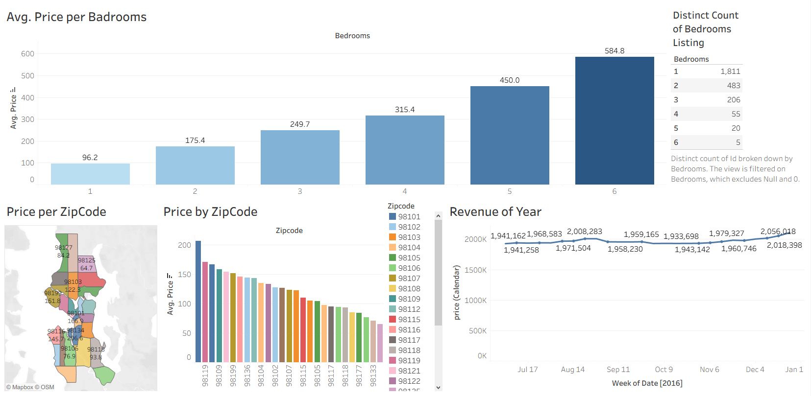

# Tableau — Airbnb Listing Analysis Dashboard

## 📌 Project Overview
This project presents an interactive Tableau dashboard analyzing Airbnb listing data.  
The analysis explores pricing patterns based on number of bedrooms, geographic distribution by zipcode, and revenue trends over time.

## 🗂️ Dataset
Airbnb listing dataset containing:
- Listing prices
- Number of bedrooms
- Zipcode locations
- Weekly revenue (calendar-based)

Dataset is included in this repository.

## 🛠️ Tools Used
- Tableau Public (Data Visualization)
- Excel (Initial data cleaning)

## 📊 Key Insights

**1. Price vs Bedrooms**
- Average price increases as bedroom count increases.
- 1-bedroom listings dominate the market.
- 6-bedroom listings have the highest average price but very few listings.

**2. Price Distribution by Zipcode**
- Certain zipcodes show significantly higher average prices.
- Geographic price variation indicates location-driven demand differences.

**3. Revenue Trend Over Time**
- Weekly revenue remains relatively stable throughout the year.
- Slight revenue peaks occur in late-year months.

## 🖼️ Dashboard Preview

## 🔗 Live Dashboard
Tableau Public Link:  
https://public.tableau.com/app/profile/bayu.chandra.putra/viz/AirBnBAnalytics_17695791091020/Dashboard1?publish=yes

---
← Back to Portfolio Index:  
https://github.com/bayucp30/portfolio-data-analyst
